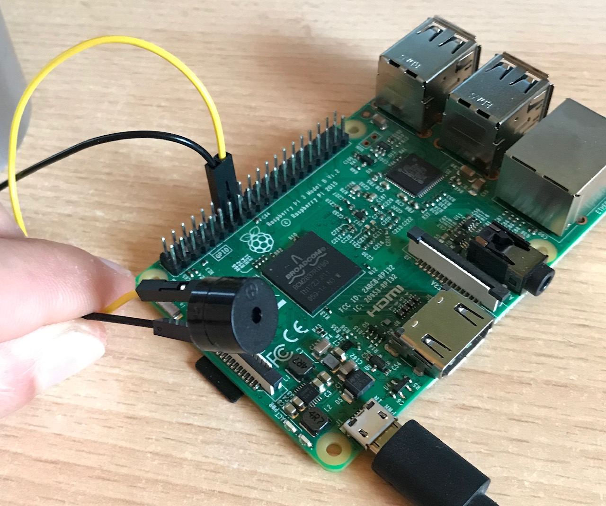

# API-Buzzer

This is a Node.js API for interact with a buzzer connected to a Raspberry Pi.  

Example of use: `http://192.168.1.35:31415/api-buzzer/short` (of course, you need to use the correct IP and port).  
Make a request to the API root to get the complete documentation.: `http://192.168.1.35:31415` (of course, you need to use the correct IP and port).  

### 📝 Requirements
* Node.js 10 or higher
* Raspberry Pi 3 Model B+ (Should be work on Raspberry Pi 2 Model B and Raspberry Pi 4 Model B)
* Buzzer (active buzzer, 5v)
* 2 female-female jumper wires

### 📚 How to prepare the hardware
1. Make sure the Raspberry Pi is not turned on.  
2. Connect a wire from the negative pole of the buzzer to any ground pin.  
3. Connect the other wire from the positive pole of the buzzer to any GPIO pin. By default, the application expects you to use the pin number 16 (physical numbering, pattern P1-P40). If you prefer to use another GPIO pin, be sure to configure the `.env` file.  

### 📚 How to run the API
* Use the command: `npm install`. If you are deploying the app in production, it's better to use this command: `npm install --production`
* Configure the application:
  * Duplicate the configuration file `_env` and rename it as `.env`
  * Edit the file `.env`
* Then use: `npm run start`. 
* That's it!

**Do you need help with `.env` file?** 

Do not worry, here you have a guide:

| Key | Description |
|-----|-------------|
| PORT | The port for running the backend |
| GPIO | The GPIO pin connected to the buzzer |

### 😭 Common problems
Some tips for solving most common problems:
* If you are using UFW firewall on Raspbian, ensures the http trafic is allowed: `sudo ufw allow from 192.168.1.0/24` (this allow all traffic from the network 192.168.1.0). Maybe you prefer allow all trafic for a specific port of API-Buzzer: `sudo ufw allow 31415/tcp`
* Are you sure you have connected the wires correctly? 🤔
* Are you sure you have configured the right GPIO port? 😬

### 💻 Tricks for development
* Run app in dev mode: `npm run dev`
* Run the linter: `npm run lint`
* Delete all log files: `npm run purge`
